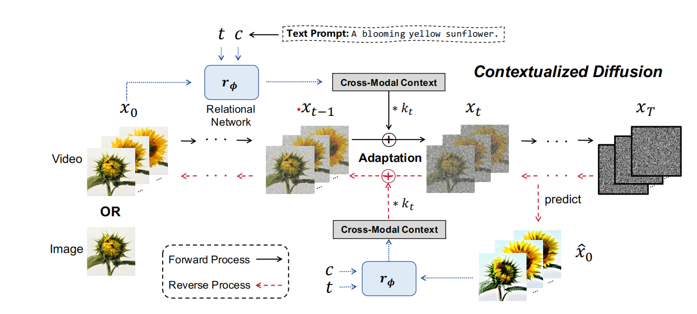
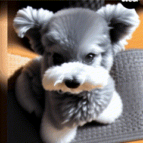
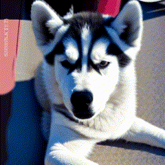
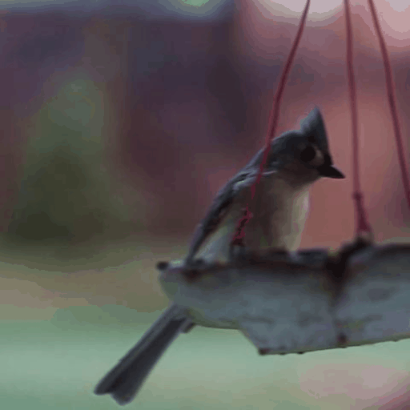
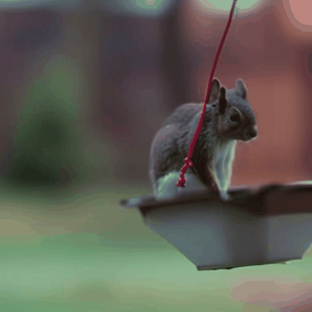
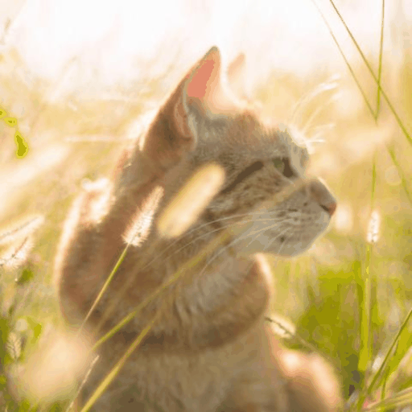
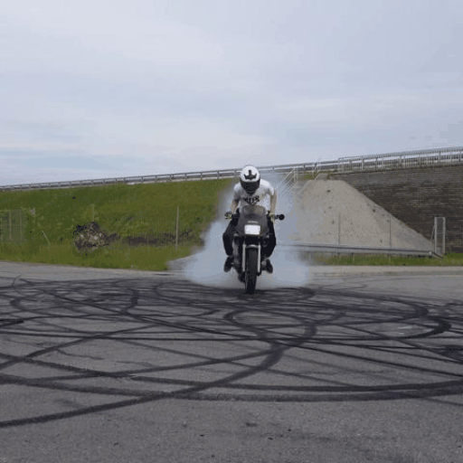
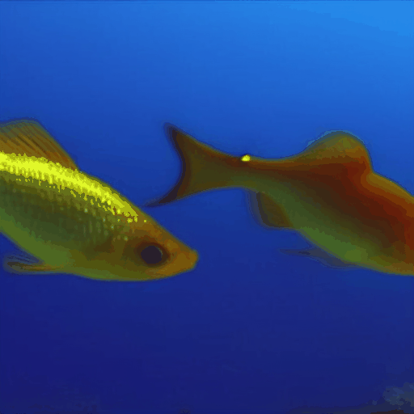
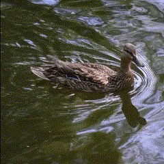
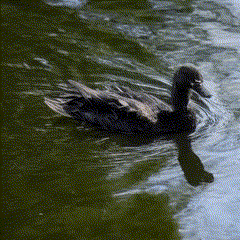

## Cross-Modal Contextualized Diffusion Models for Text-Guided Visual Generation and Editing - ICLR 2024

This repository contains the official implementation of  [ContextDiff](https://openreview.net/forum?id=nFMS6wF2xq) published in ICLR 2024.

>[**Cross-Modal Contextualized Diffusion Models for Text-Guided Visual Generation and Editing**](https://openreview.net/forum?id=nFMS6wF2xq)    
>[Ling Yang](https://yangling0818.github.io/), 
>[Zhilong Zhang](),
>[Zhaochen Yu](https://github.com/BitCodingWalkin), 
>[Jingwei Liu](),
>[Minkai Xu](https://minkaixu.com/),
>[Stefano Ermon](https://cs.stanford.edu/~ermon/), 
>[Bin Cui](https://cuibinpku.github.io/) 
<br>**Peking University, Stanford University**<br>

<details>
    <summary>Click for full abstract</summary>
    Conditional diffusion models have exhibited superior performance in high-fidelity
text-guided visual generation and editing. Nevertheless, prevailing text-guided visual diffusion models primarily focus on incorporating text-visual relationships
exclusively into the reverse process, often disregarding their relevance in the forward process. This inconsistency between forward and reverse processes may
limit the precise conveyance of textual semantics in visual synthesis results. To
address this issue, we propose a novel and general contextualized diffusion model
(ContextDiff) by incorporating the cross-modal context encompassing interactions and alignments between text condition and visual sample into forward and
reverse processes. We propagate this context to all timesteps in the two processes
to adapt their trajectories, thereby facilitating cross-modal conditional modeling.
We generalize our contextualized diffusion to both DDPMs and DDIMs with theoretical derivations, and demonstrate the effectiveness of our model in evaluations
with two challenging tasks: text-to-image generation, and text-to-video editing.
In each task, our ContextDiff achieves new state-of-the-art performance, significantly enhancing the semantic alignment between text condition and generated
samples, as evidenced by quantitative and qualitative evaluations.
</details>

## Introduction

<table class="center">
    <tr>
    <td width=100% style="border: none"></td>
    </tr>
    <tr>
    <td width="100%" style="border: none; text-align: center; word-wrap: break-word">Overview of our ContextDiff
</td>
  </tr>
</table>

We propose a novel and general cross-modal contextualized diffusion model (**ContextDiff**) that harnesses cross-modal context to facilitate the learning capacity of cross-modal diffusion models, including **[text-to-image generation](./ContextDiff_image), and text-guided video editing**.

## 🚩 New Updates 

**[2024.1]** Our main code along with demo images and videos is released.

## Gallery

<table class="center">
        <tr style="line-height: 0">
    <td width=25% style="border: none; text-align: center">Source(Sunflower)</td>
    <td width=25% style="border: none; text-align: center">Edited(Rose)</td>
    <td width=25% style="border: none; text-align: center">Source(Sunflower)</td>
    <td width=25% style="border: none; text-align: center">Edited(Carnation)</td>
    </tr>
    <tr>
    <td width=25% style="border: none"></td>
    <td width=25% style="border: none"></td>
    <td width=25% style="border: none"></td>
    <td width=25% style="border: none"></td>
    </tr>
</table>

<table class="center">
        <tr style="line-height: 0">
    <td width=25% style="border: none; text-align: center">Source(Schnauzer)</td>
    <td width=25% style="border: none; text-align: center">Edited(Golden)</td>
    <td width=25% style="border: none; text-align: center">Source(Schnauzer)</td>
    <td width=25% style="border: none; text-align: center">Edited(Husky)</td>
    </tr>
    <tr>
    <td width=25% style="border: none"></td>
    <td width=25% style="border: none"></td>
    <td width=25% style="border: none"></td>
    <td width=25% style="border: none"></td>
    </tr>
</table>
<table class="center">
        <tr style="line-height: 0">
    <td width=25% style="border: none; text-align: center">Source(Bird)</td>
    <td width=25% style="border: none; text-align: center">Edited(Squirrel)</td>
    <td width=25% style="border: none; text-align: center">Source(Cat)</td>
    <td width=25% style="border: none; text-align: center">Edited(Dog)</td>
    </tr>
    <tr>
    <td width=25% style="border: none"></td>
    <td width=25% style="border: none"></td>
    <td width=25% style="border: none"></td>
    <td width=25% style="border: none"></td>
    </tr>
</table>

<table class="center">
        <tr style="line-height: 0">
    <td width=25% style="border: none; text-align: center">Source(Road)</td>
    <td width=25% style="border: none; text-align: center">Edited(Frozen lake)</td>
    <td width=25% style="border: none; text-align: center">Source(Woman)</td>
    <td width=25% style="border: none; text-align: center">Edited(Astronaut)</td>
    </tr>
    <tr>
    <td width=25% style="border: none"></td>
    <td width=25% style="border: none"></td>
    <td width=25% style="border: none"></td>
    <td width=25% style="border: none"></td>
    </tr>
</table>

<table class="center">
        <tr style="line-height: 0">
    <td width=25% style="border: none; text-align: center">Source(Shark)</td>
    <td width=25% style="border: none; text-align: center">Edited(Gold Fish)</td>
    <td width=25% style="border: none; text-align: center">Source(Mallard)</td>
    <td width=25% style="border: none; text-align: center">Edited(Black swam)</td>
    </tr>
    <tr>
    <td width=25% style="border: none"></td>
    <td width=25% style="border: none"></td>
    <td width=25% style="border: none"></td>
    <td width=25% style="border: none"></td>
    </tr>
</table>

## Preparations

**Environment Setup**

```bash
git clone https://github.com/YangLing0818/ContextDiff.git
conda create -n ContextDiff python==3.8
conda activate ContextDiff
pip install -r requirements.txt
pip install git+https://github.com/openai/CLIP.git
```

**Install Xformers to Save Memory**

We recommend to use xformers to save memory:

```bash
wget https://github.com/ShivamShrirao/xformers-wheels/releases/download/4c06c79/xformers-0.0.15.dev0+4c06c79.d20221201-cp38-cp38-linux_x86_64.whl
pip install xformers-0.0.15.dev0+4c06c79.d20221201-cp38-cp38-linux_x86_64.whl
```

**Download Model Weights**

Here we choose [Stable Diffusion](https://arxiv.org/abs/2112.10752) as our diffusion backbone, you can download the model weights using our [download.py](ckpt/download.py) in folder 'ckpt/'. 

```bash
cd ckpt
python download.py 
wget "https://openaipublic.azureedge.net/clip/models/8fa8567bab74a42d41c5915025a8e4538c3bdbe8804a470a72f30b0d94fab599/RN101.pt"
wget "https://openaipublic.azureedge.net/clip/models/40d365715913c9da98579312b702a82c18be219cc2a73407c4526f58eba950af/ViT-B-32.pt"
wget "https://openaipublic.azureedge.net/clip/models/5806e77cd80f8b59890b7e101eabd078d9fb84e6937f9e85e4ecb61988df416f/ViT-B-16.pt"
cd ..
```

**Finetune with ContextDiff**

You can reproduce our video editing results by running:

```bash
CUDA_VISIBLE_DEVICES=0 python ContextDiff_finetune.py --config config/rose.yaml
```

You can also try your own video samples by using personalized config file, you should use put the video frames into '[./data](./data)' folders, and config file into '[./config](./config)'. Please note that **using the adapter/shifter pretrained from [text-to-image generation part](./ContextDiff_image)** would further eanhance semantic alignment of the edited videos.

The edited videos and finetuned checkpoint are placed in './result'

```
result
├── name
│   ├── checkpoint_50
│   ├── checkpint_100
|   .....
|   ├── checkpoint_200 
|   ├── sample
|   |   ├── sample_50
......
```


## Citation
```
@inproceedings{yang2024crossmodal,
  title={Cross-Modal Contextualized Diffusion Models for Text-Guided Visual Generation and Editing},
  author={Ling Yang and Zhilong Zhang and Zhaochen Yu and Jingwei Liu and Minkai Xu and Stefano Ermon and Bin CUI},
  booktitle={International Conference on Learning Representations},
  year={2024}
}
```

